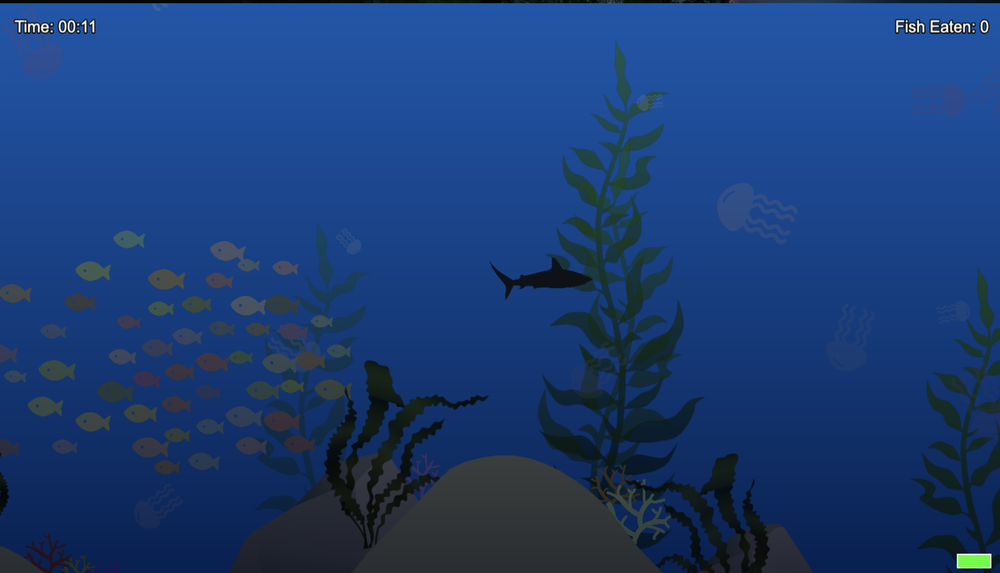

# Fish Game
A simple underwater game where you play as a shark swimming through a procedurally generated ocean environment. Hunt schools of fish and avoid obstacles.



### Features:
- Dynamic fish AI with flocking behavior
- Procedurally generated terrain with rocks, kelp, and coral
- Water surface effects
- Physics-based movement and collisions
- Ambient jellyfishes
- Atmospheric underwater environment with depth gradients and particle effects

### Controls:
- Move arrow keys
- Hold SPACE to sprint (uses stamina)
- Release SPACE to recover stamina

## Debug options
Type "debugfish" to display debug options.


## Deployment
The game is deployed and playable at: https://m0rgho.github.io/fish-game/


## How to run locally:
1. Install:
```
npm install
```
2. Start dev server:
```
npm run dev
```
---
Mikołaj Maślak, Szymon Głomski